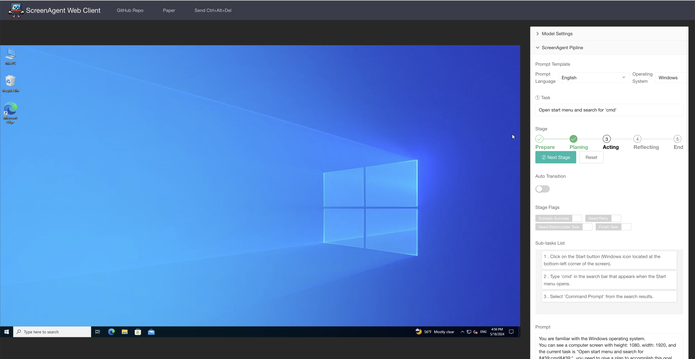

<p align="center">
    <h1 align="center">   ScreenAgent Web Client </h1>
    <h2 align="center"> Let Large Models Control Your Desktop </h2>
</p>




## Introduction

ScreenAgent is a web-based remote desktop client that allows Large Models to directly control computer desktops via remote desktop protocols. It is built on top of [noVNC](https://github.com/novnc/noVNC). It is suitable for applications where a large model needs to interact with a desktop environment, such as reinforcement learning, robotics, and human-computer interaction.

You can learn about the design concept of this pipeline in our paper: [arxiv:2402.07945](https://arxiv.org/abs/2402.07945) and Github repository: [ScreenAgent](https://github.com/niuzaisheng/ScreenAgent).

## Features
- Use cloud API or self-server API to drive the pipeline.
- Mouse and keyboard actions are converted into json or function call form, with uniform action type definitions to train large models to control the desktop.
- Can construct (choosen, rejected) form data for RLHF training.

## Quick start

Step 1, Prepare the desktop to be controlled.
First, you need to prepare the desktop operating system to be controlled, where the VNC Server is installed, such as [TightVNC](https://www.tightvnc.com/download.php).

Step 2, Start a websockify to connect to the VNC server.
The [websockify](https://github.com/novnc/websockify) translates WebSockets traffic to normal socket traffic, so you can connect to a VNC server from a web browser.

```sh
./novnc_proxy --vnc localhost:5900
```
where:
` --vnc ` is the address and port of the VNC server you want to connect to, you maybe need to change the port number according to your VNC server configuration.
` ./novnc_proxy ` will clone the websockify repository and start the websockify server.

Then open your browser and visit https://screenagent.pages.dev to see the ScreenAgent web page. You will be asked for your Remote Desktop connection password when the page loads, the password will send to your own websockify listen by `novnc_proxy`, and will not upload to the cloud.

Simple as that.

## Build and run the ScreenAgent web client locally

```sh
npm install
npm run build

git clone https://github.com/novnc/websockify.git
./novnc_proxy --web dist --listen localhost:6080 --vnc localhost:5900
```
Then open your browser and visit `http://localhost:6080` to see the ScreenAgent web page.

## For Development

```sh
npm install
npx patch-package @novnc/novnc
npm run dev
```
